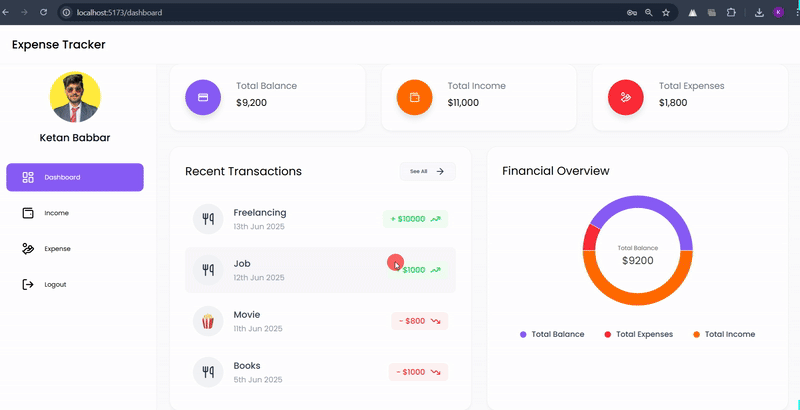

# 💰 Expense Tracker - MERN Stack Application

A full-featured Expense Tracker built using the **MERN Stack (MongoDB, Express, React, Node.js)**. Easily manage and visualize your income and expenses with a beautiful, responsive interface and powerful data insights.

---

---

## 📌 Features

1. 🔐 **User Authentication** – Secure sign-up and login using **JWT tokens**.
2. 📊 **Dashboard Overview** – View Total Balance, Income, and Expenses at a glance.
3. ➕ **Income Management** – Add, view, delete, and export your income sources.
4. ➖ **Expense Management** – Categorize, track, and export your expenses.
5. 📈 **Interactive Charts** – Visualize income & expense data using **Bar, Pie, and Line** charts.
6. 🕒 **Recent Transactions** – Quick access to the latest income and expenses.
7. 📥 **Reports Download** – Export all transactions to **Excel format** with a single click.
8. 📱 **Mobile Responsive** – Smooth experience across **desktop, tablet, and mobile**.
9. 🧭 **Intuitive Navigation** – Sidebar menu for easy access to all sections.
10. 🗑️ **Delete Functionality** – Hover-to-reveal delete option for quick edits.

---

## 🛠️ Tech Stack

- **Frontend**: React, Tailwind CSS / CSS Modules, Chart.js
- **Backend**: Node.js, Express.js
- **Database**: MongoDB with Mongoose
- **Authentication**: JSON Web Tokens (JWT)
- **File Export**: XLSX (Excel) support using `xlsx` library

---

## 📸 Screenshots

> Add your screenshots or GIFs here  
> Example:  
> 

---

## 📦 Installation

```bash
# Clone the repository
git clone https://github.com/babbarketan/Expense_Tracker_MERN_STACK.git
cd Expense_Tracker_MERN_STACK

# Install server dependencies
cd backend
npm install

# Install client dependencies
cd ../frontend
npm install

# Start backend
npm run dev

# Start frontend
npm run dev
